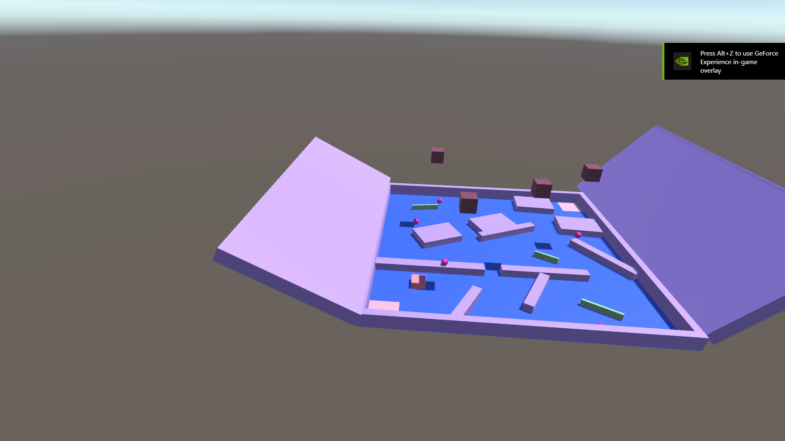

<!-- GAME PROJECT TITLE -->
# Obstacle-Course---Game
Game created for study purposes by Matheus Soares Martins, in this game you control a character across an onstacle course, that have
objects that falls, balls that roll into the player, spinners, and narrow passages and such.
 
This game tests lots of core gaming functions, just as gravity, movement, rotation, variables, functions, shortcuts and other concepts.
 

This game was made to be played by one player, and its goal is for the player to reach the end while avoiding colliding with the
obstacles.
 

Game Controls 
- Player controls: 
Up Arrow or W - Goes up with the player. 
Left Arrow or A - Goes left with the player. 
Right Arrow or D - Goes right with the player. 
Down Arrow or S - Goes down with the player. 

- Other controls: 
Esc - Closes the game. 
F11 - Toggle between fullscreen and windowed mode. 
******************************************************************************

 

<!-- GAME PROJECT IMAGES -->
# Screenshots

<!-- GAME PROJECT BUILDS -->
# Game download 
## Windows: https://mega.nz/folder/AEUV2JSY#Dox0x0tBkvzr1XthG39_tA
## Mac: https://mega.nz/folder/sck3FLwA#OqgBQNR-VKRjF3xPGitk-A
## Linux:  https://mega.nz/folder/cJ8g1BrC#JAJzsLdiQowbDvE0VQtzEw